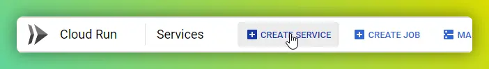
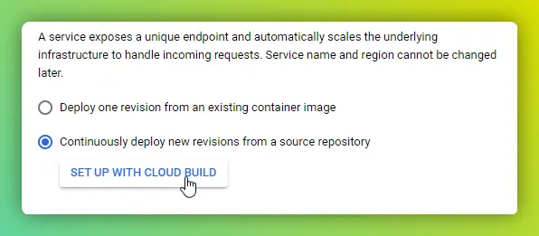
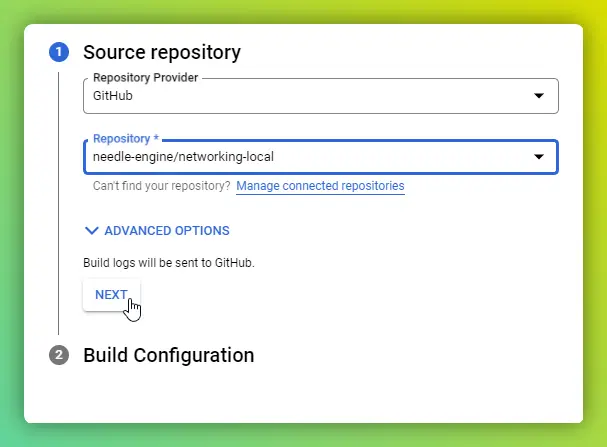
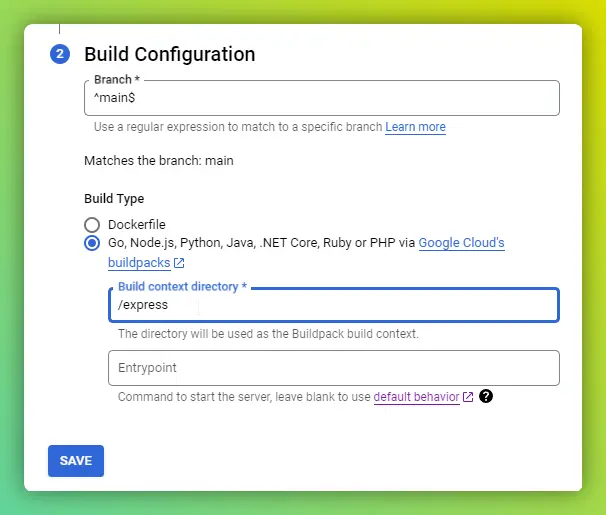
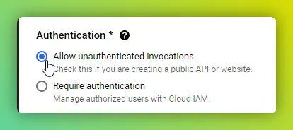
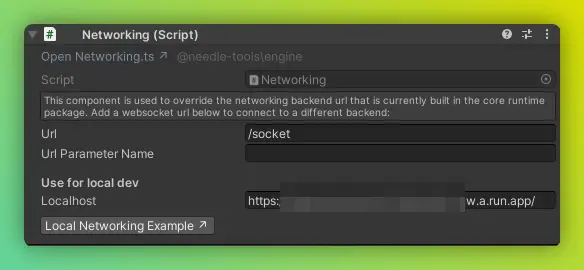

# Needle Engine Networking Server

This repsitory demonstrates running the Needle Engine networking server on top of the node.js-based Express framework. The server can be run locally or hosted in the cloud.

For more information about networking in Needle Engine, please refer to the [Needle Engine documentation](https://engine.needle.tools/docs/networking.html).

## Running the server locally

### Starting the server
1. Install Node.js
2. Do either of the following:
   - **Option A** – automatic setup
     1. Run `START_EXPRESS.bat`, which will install dependencies and then start the server on port 9001

   - **Option B** – manual setup
     1. Open the `/express` folder
     2. run `npm i` 
     3. run `npm run dev`, which will start the server on port 9001

### Using the local server
1) Start the server using one of the options above.

2) The server console should print a message like  
    ```bash
    Websocket endpoint is wss://localhost:9001/socket**
    ```
3) Copy the base websocket URL, and paste it into the Needle Engine **Networking component**:   
Set the *Localhost* field to `wss://localhost:9001`.

    

4) Start your Needle Engine local server as usual.
The browser console will contain a log like 
    ```bash
    Connected to networking backend wss://localhost:9001/socket
    ```

5) All network messages are now sent to the local server. The room state is stored in `/express/.data` as JSON files. The console will contain additional logs for users joining, leaving rooms, rooms being created and closed, and so on.

## Hosting the server in the cloud

### Glitch

- Go to https://needle-networking.glitch.me/

- Click "Remix" in the bottom right corner
- Wait for the server to start
- Click on "Open in new window" in the top right corner of the Glitch UI
- Copy the URL from the new window and paste it into the Needle Engine Networking component.

### Google Cloud

- Go to https://console.cloud.google.com/run/create  
    

- Select `Continuously deploy new revisions from a source repository`  
    
- Click the `SET UP WITH CLOUD BUILD` button
- Select your source repository (it can be this repository or a fork)    
    
- Click `NEXT`
- Optionally change the branch that should trigger a build. By default it uses your main branch.
- In `Build Type` select `Go, Node, ... Google Cloud's buildpacks`
- Enter the directory where the server is located. In this case `/express`  
  
- Click `SAVE`
- Select a `Region` where your server should run
- Modify the Autoscaling options to your liking
- Enable `Allow unauthorized invocations`  
  
- Click `CREATE`
- You can now go to the [google cloud builds page](https://console.cloud.google.com/cloud-build/builds) to see your server being deployed and it should shortly after be available on [your cloud run URL](https://console.cloud.google.com/run)


You can enter your new server URL in the Needle Engine Networking component to send and receive messages from there:



## Contact
<b>[needle – tools for creators](https://needle.tools)</b> • 
[@NeedleTools](https://twitter.com/NeedleTools) • 
[@marcel_wiessler](https://twitter.com/marcel_wiessler) • 
[@hybridherbst](https://twitter.com/hybridherbst)
